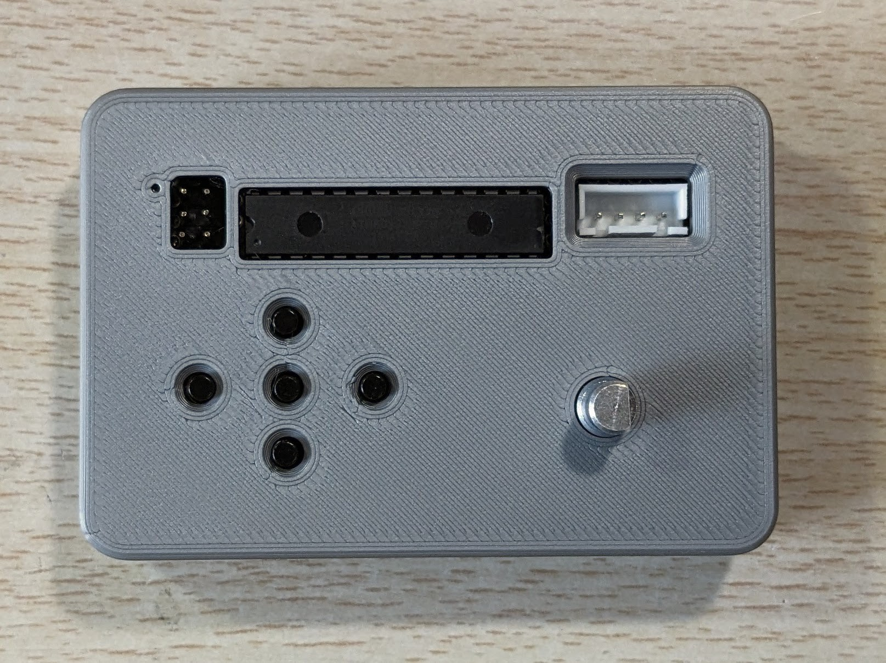
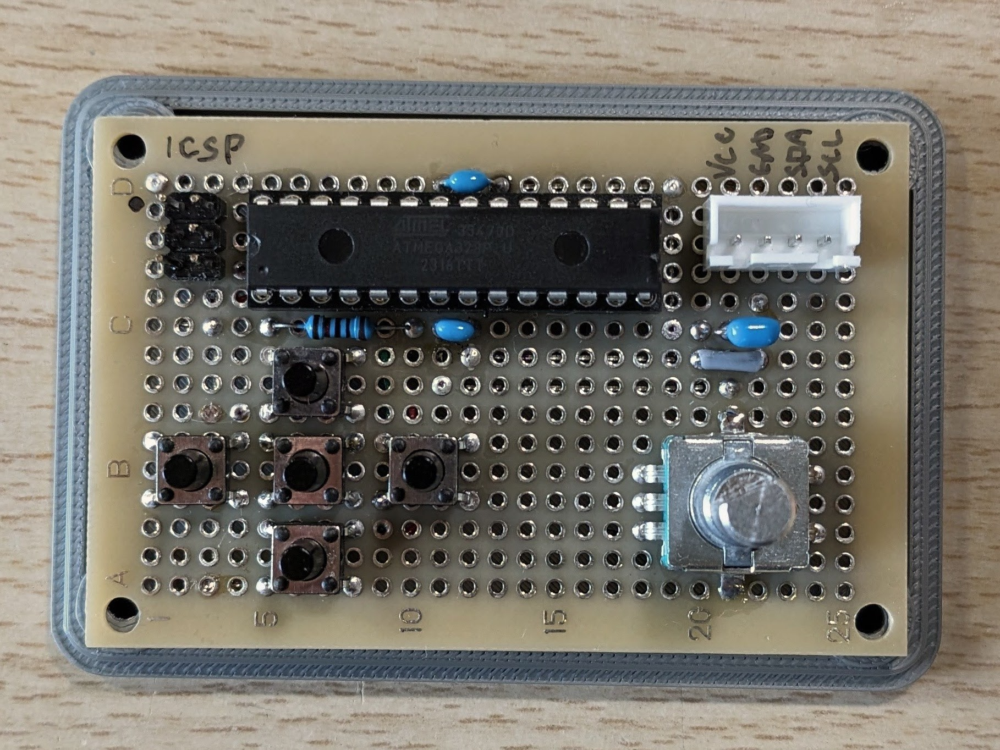
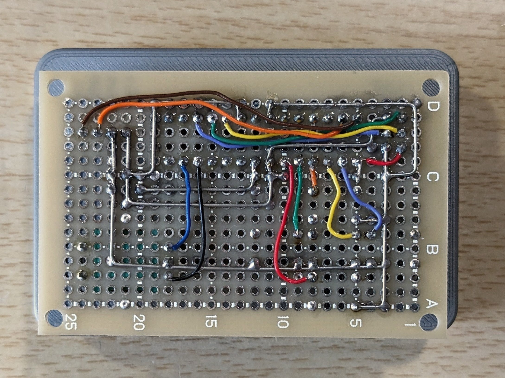

# I2C Input Device (ATmega328P)

## 概要
- ATmega328P を用いた I2C接続の入力デバイス
- 5ボタン＋ロータリーエンコーダーを搭載
- 差分式エンコーダ出力およびステータスビットを2バイト固定フォーマットで出力
- 動作テスト用デバイスも製作(Test Device)

## 主な機能
- I2Cスレーブ
- 2バイト固定レスポンス
- 差分式エンコーダー

## 出力
I2C 応答フォーマット（Read 2 bytes）
- Byte0: エンコーダー差分 (int8_t)
  - 前回 Read 以降の差分
    - -128..127 に飽和（超えたら status=001 を立てる）
    - Read したタイミングで g_encAcc を 0 にリセット（差分式）

- Byte1: 上位3bit=ステータス, 下位5bit=ボタン押下(押下で1)
  - bit0: center
  - bit1: up
  - bit2: right
  - bit3: down
  - bit4: left
  - status:
    - 000 = 正常
    - 001 = overflow（飽和/内部飽和などの異常を検出）

## ハード構成
- ATmega328P (3.3V, internal 8MHz)
- 5x tactile switch
- 12/15 encoder

## 写真
外観

基板

回路図

## ビルド方法
### 開発環境
- Arduino IDE 2.3.7
- ボードパッケージ: ATmega328（MiniCore）
- 書き込み方式: Arduino as ISP
- ターゲット: ATmega328P（3.3V / 内部8MHz）

### ボード設定
- ボード: ATmega328
- Variant: 328P / 328PA
- Clock: Internal 8 MHz
- Bootloader: No bootloader
- BOD: BOD 2.7V
- EEPROM: EEPROM retained
- Compiler LTO: LTO enabled

### Fuse値
|Fuse|値|意味|
|---|---|---|
|L|E2|内部8MHz、CKDIV8無効|
|H|DA|SPI有効、BOOT無効|
|E|FD|BOD有効|

### I2C動作条件
- 電源: 3.3V
- クロック: 100kHz
- I2Cアドレス: 0x12
- 外部プルアップ抵抗はマスター側に実装

### 注意事項
- attachInterrupt は使用せず、PCINT を使用している
- onRequest 内で割り込み状態を変更しないこと
- ENC_STEPS_PER_NOTCH はエンコーダ個体に応じて調整すること

### 禁止事項
**書き込み装置とマスターの同時接続は禁止**  
特に書き込み装置とマスターのロジックレベルが異なる場合、電源ラインの逆流やI/Oピンへの過電圧などが生じてデバイスが破損する可能性がある。
- 書き込み時は必ずマスター側を取り外すこと
- 運用時は ISP ケーブルを接続しないこと
