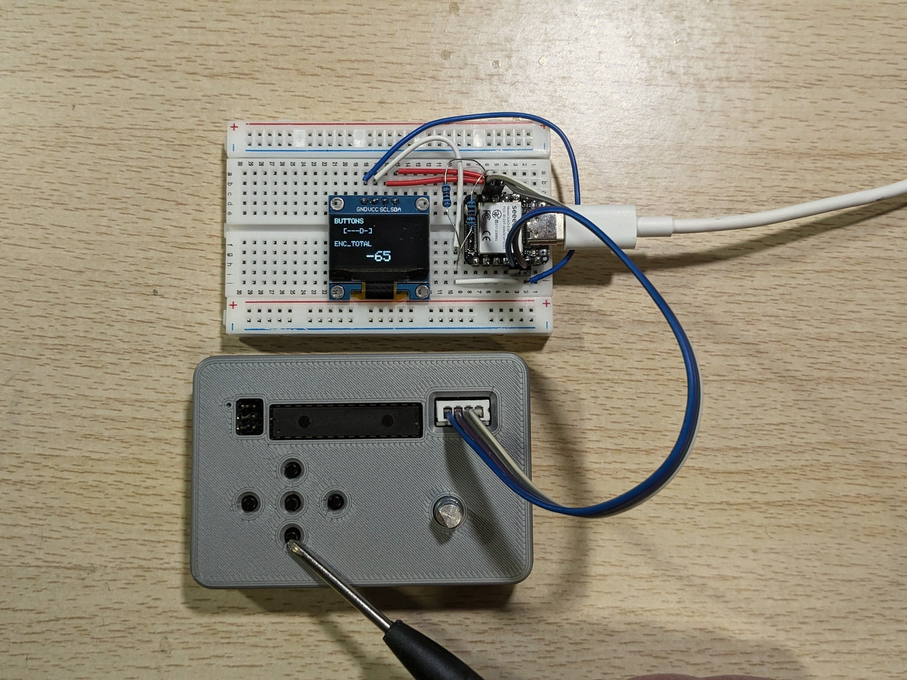
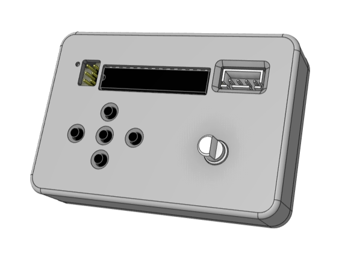
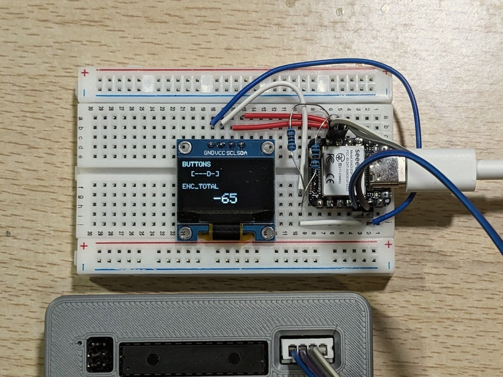

# i2c-input-device
## 概要
- I2C スレーブとして、入力状態を 2バイト固定で返す
- Core: ATmega328P, 3.3V, internal 8MHz
- ボタン 5個 + ロータリーエンコーダ（A/B, スイッチ無し）
- GitHubの練習のためのリポジトリ
- 未完成

## 出力
- I2C 応答フォーマット（Read 2 bytes）
  - Byte0: enc_delta (int8_t)
      - 前回 Read 以降の差分
      - -128..127 に飽和（超えたら status=001 を立てる）
      - Read したタイミングで g_encAcc を 0 にリセット（差分式）

  - Byte1: 上位3bit=status, 下位5bit=buttons
    - bit0: center
    - bit1: up
    - bit2: right
    - bit3: down
    - bit4: left
    - status:
      - 000 = 正常
      - 001 = overflow（飽和/内部飽和などの異常を検出）

## イメージ
動作確認

外観

基板

回路図

3Dモデル

テスト用デバイス

