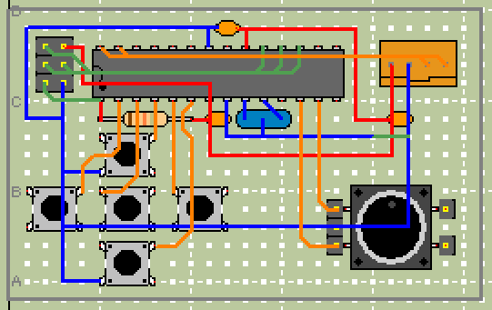

# ATmega328P (DIP) ピンアサイン
```
                            ATmega328P
                            -----------
    RESET / VCC via R - PC6|1    U   28|PC5 - SCL
             BTN_LEFT - PD0|2        27|PC4 - SDA
           BTN_CENTER - PD1|3        26|PC3 - NC
               BTN_UP - PD2|4        25|PC2 - NC
            BTN_RIGHT - PD3|5        24|PC1 - NC
             BTN_DOWN - PD4|6        23|PC0 - NC
DECAP3 / DECAP1 / VCC - VCC|7        22|GND - GND / DECAP2
DECAP3 / DECAP1 / GND - GND|8        21|AREF - NC
         NC(for XTAL) - PB6|9        20|AVCC - DECAP2
         NC(for XTAL) - PB7|10       19|PB5 - SCK
                   NC - PD5|11       18|PB4 - MISO
                ENC_A - PD6|12       17|PB3 - MOSI
                ENC_B - PD7|13       16|PB2 - NC
                   NC - PB0|14       15|PB1 - NC
                            -----------
```

## 接続
|ピン番号|機能|接続|
|---|---|---|
|1|RESET|PC6 --- J2 --- 10kR --- VCC|
|2|DIGITAL|PD0 --- BTN_LEFT ---GND|
|3|DIGITAL|PD1 --- BTN_CENTER --- GND|
|4|DIGITAL|PD2 --- BTN_UP --- GND|
|5|DIGITAL|PD3 --- BTN_RIGHT --- GND|
|6|DIGITAL|PD4 --- BTN_DOWN --- GND|
|7|VCC|VCC --- (0.1uF to GND) --- (4.7uF to GND) --- J1 --- J2|
|8|GND|GND --- J1 --- J2 --- ENC_C|
|9|(XTAL)|PB6 --- NC|
|10|(XTAL)|PB7 --- NC|
|11|-|PD5 --- NC|
|12|PCINT|PD6 --- ENC_A|
|13|PCINT|PD7 --- ENC_B|
|14|-|PB0 --- NC|
|15|-|PB1 --- NC|
|16|-|PB2 --- NC|
|17|MOSI|PB3 --- J2|
|18|MISO|PB4 --- J2|
|19|SCK|PB5 --- J2|
|20|AVCC|AVCC --- (0.1uF to GND) --- VCC|
|21|-|AREF --- NC|
|22|GND|GND --- GND|
|23|-|PC0 --- NC|
|24|-|PC1 --- NC|
|25|-|PC2 --- NC|
|26|-|PC3 --- NC|
|27|SDA|PC4 --- J1|
|28|SCL|PC5 --- J1|

J1 = マスター接続ピン (VCC, GND, SDA, SCL)  
J2 = ICSPピン

## 配線イメージ


# 部品リスト
- ATmega328P (DIP)
- ICソケット
- ロータリーエンコーダ
- 5 * タクトスイッチ
- 4.7uF コンデンサ
- 2 * 0.1uF コンデンサ
- 10kΩ 抵抗
- 4ピン JST XH ポスト
- 2x3 ピンヘッダ
- セラロック (任意)
- ユニバーサル基板 秋月Cタイプ

